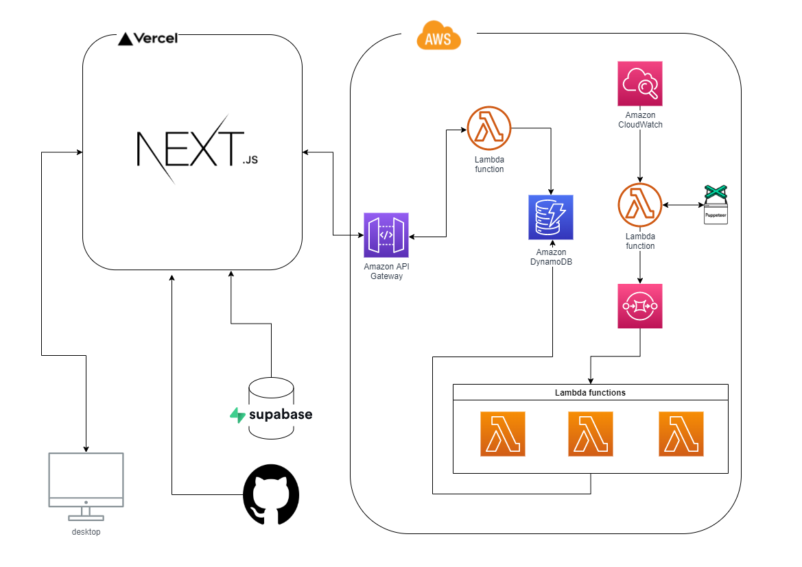

# NewsPaper for You - SNS like news compare app

News app based on multiple real world news resources created with  
Next.js, Supabase.io and AWS

> Live demo [_here_](https://newspaper-for-you-v2.vercel.app/).

## Table of Contents

- [General Info](#general-information)
- [Architecture](#architecture)
- [Technologies Used](#technologies-used)
- [Features](#features)
- [Screenshots](#screenshots)
- [Setup](#setup)
- [Usage](#usage)
- [Project Status](#project-status)
- [Room for Improvement](#room-for-improvement)
- [Acknowledgements](#acknowledgements)
- [Contact](#contact)
<!-- * [License](#license) -->

## General Information

- User can compare news of two biggest news company in japan, while be able to
  interact with other user by basic CRUD function
- Information is overloaded these days. Though, picking a right tool update your information is a matter of life and death. To make you choose a right channel to get information, I decide to make this app which could make user to choose resources while preventing from obtaining biased information. Also, user could know what other user saved and read.

## Architecture

## Technologies Used

- Next.js - version 11.1.2
- SASS - version 1.39
- storybook - version 6.3.8
- puppeteer - 10.4.0
- supabase - 1.22.6

## Features

- User can compare newswebsite side by side which update every 6 hours
- User can save news title and link after logged in
- User can read news title which other user saved
- User can write a blog by using react simple mde editor

## Screenshots

<!-- If you have screenshots you'd like to share, include them here. -->

## Setup

What are the project requirements/dependencies? Where are they listed? A requirements.txt or a Pipfile.lock file perhaps? Where is it located?

Proceed to describe how to install / setup one's local environment / get started with the project.

## Usage

How does one go about using it?
Provide various use cases and code examples here.

`write-your-code-here`

## Project Status

Project is: _in progress_ / _complete_ / _no longer being worked on_. If you are no longer working on it, provide reasons why.

## Room for Improvement

Include areas you believe need improvement / could be improved. Also add TODOs for future development.

Room for improvement:

- Improvement to be done 1
- Improvement to be done 2

To do:

- Feature to be added 1
- Feature to be added 2

## Acknowledgements

Give credit here.

- This project was inspired by...
- This project was based on [this tutorial](https://www.example.com).
- Many thanks to...

## Contact

Created by [@flynerdpl](https://www.flynerd.pl/) - feel free to contact me!

<!-- Optional -->
<!-- ## License -->
<!-- This project is open source and available under the [... License](). -->

<!-- You don't have to include all sections - just the one's relevant to your project -->
